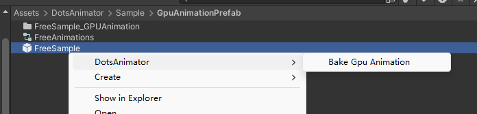

Dots下面实现一个animator状态机

已经实现的功能
- int ,float，trigger，bool 参数控制动画
- animationSpeed 和 speed param 控制动画
- 直接修改AnimatorComponent 里面sate 实现Animator.Play播放动画
  

GpuAnimation文件夹下面是顶点gpu动画的一个简单实现，展示如何和DotsAnimator 配合使用
- **注意：** 没有实现合并网格和合并材质,动画过渡暂时未支持

---

Implement an Animator State Machine in DOTS

Features already implemented:

- Control animation using int, float, trigger, and bool parameters.
- Manage animation playback speed using animationSpeed and speed parameters.

The GpuAnimation folder contains a simple implementation of vertex GPU animation, demonstrating how to integrate it with DotsAnimator.